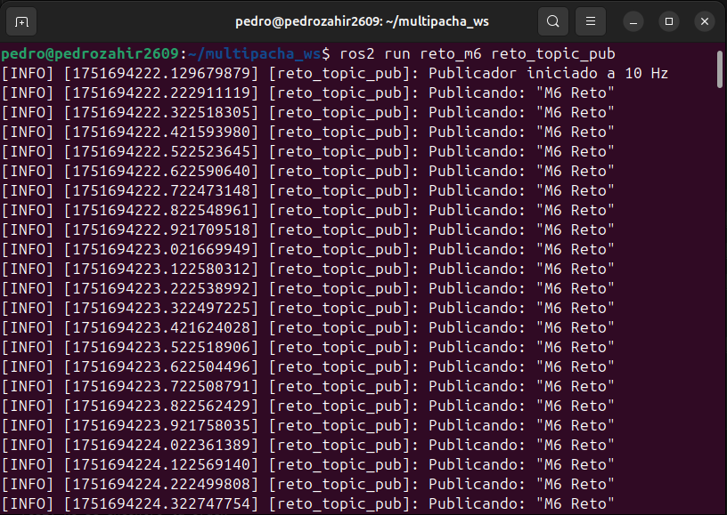
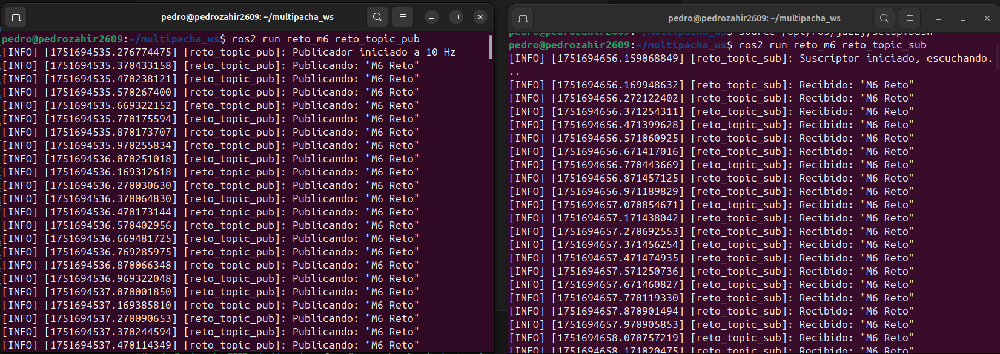
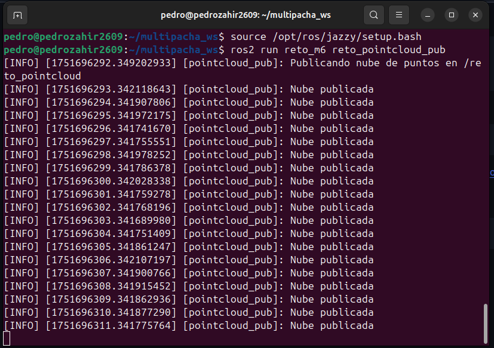
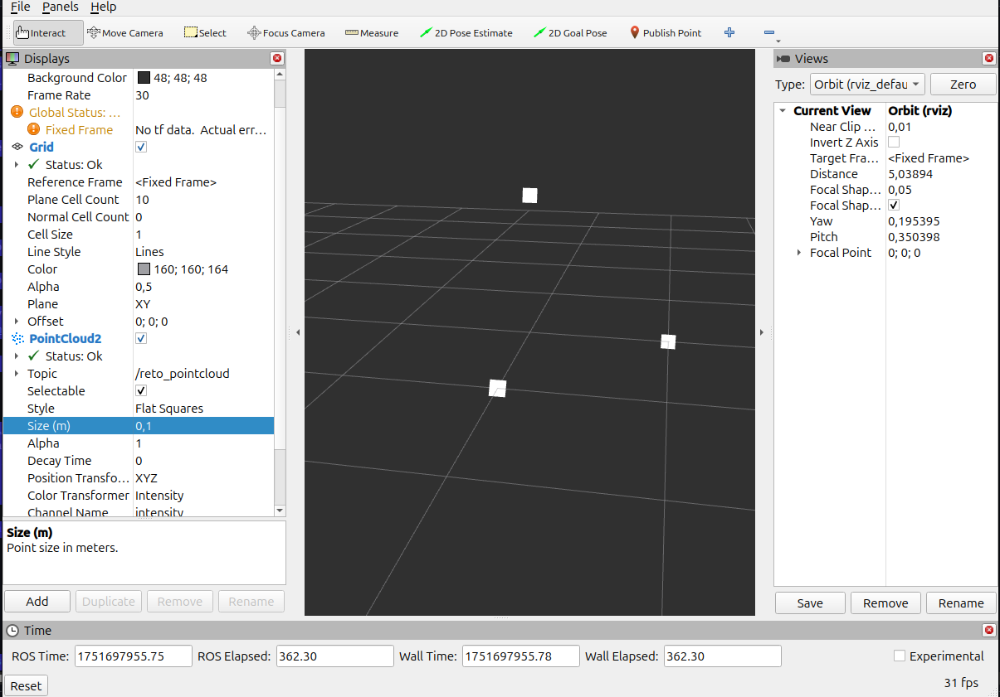
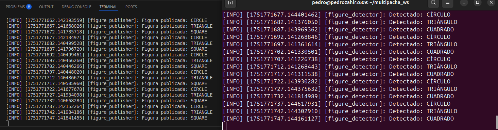
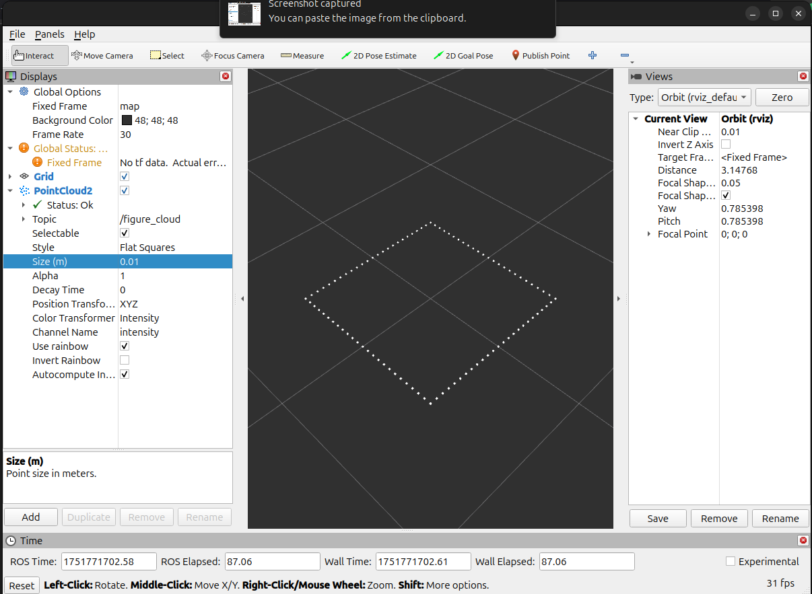
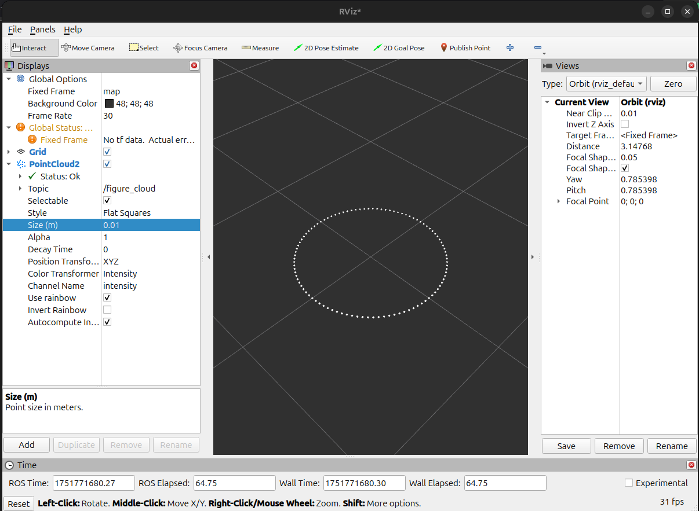
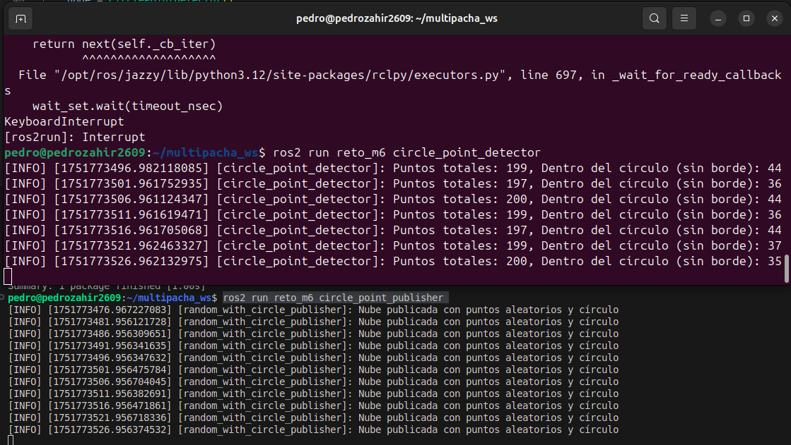
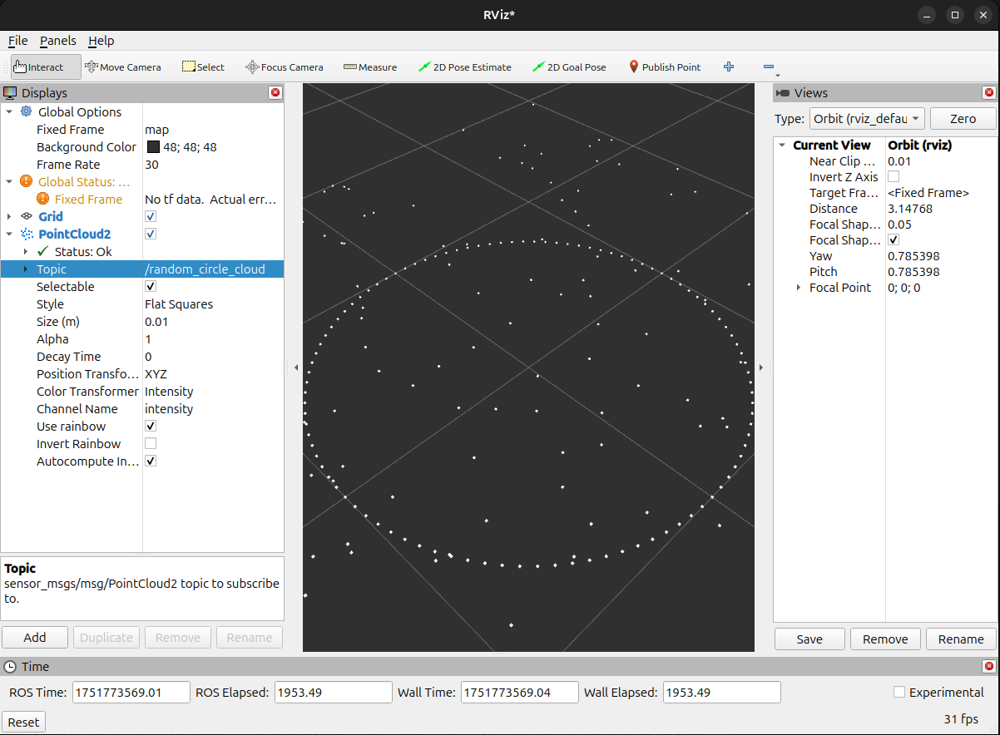

# Reto Multipacha

## I. Instalación

### Requisitos Previos
- Sistema operativo: Ubuntu 22.04 (o superior)
- Visual Studio Code
- ROS2 Jazzy Jalisco instalado
- Dependencias de sistema operativo estándar para desarrollo de ROS2
- RVIZ2

### Pasos para instalación de ROS2 Jazzy

Una vez instalado Ubuntu 22.04 y el editor Visual Studio Code, procedí a instalar **ROS2 Jazzy** y sus herramientas necesarias siguiendo estos pasos:

1. Configuré el sistema y la codificación UTF-8:

```bash
locale  # Comprobar si ya se usa UTF-8

sudo apt update && sudo apt install locales
sudo locale-gen en_US en_US.UTF-8
sudo update-locale LC_ALL=en_US.UTF-8 LANG=en_US.UTF-8
export LANG=en_US.UTF-8

locale  # verify settings
```

2. Habilité los repositorios necesarios:
```bash
sudo apt install software-properties-common
sudo add-apt-repository universe
```
3. Añadí el repositorio de ROS2:
```bash
sudo apt update && sudo apt install curl -y
```
```bash
export ROS_APT_SOURCE_VERSION=$(curl -s https://api.github.com/repos/ros-infrastructure/ros-apt-source/releases/latest | grep -F "tag_name" | awk -F\" '{print $4}')
curl -L -o /tmp/ros2-apt-source.deb "https://github.com/ros-infrastructure/ros-apt-source/releases/download/${ROS_APT_SOURCE_VERSION}/ros2-apt-source_${ROS_APT_SOURCE_VERSION}.$(. /etc/os-release && echo $VERSION_CODENAME)_all.deb"
sudo dpkg -i /tmp/ros2-apt-source.deb
```
4. Instalé herramientas de desarrollo para ROS2:
```bash
sudo apt update
sudo apt install ros-dev-tools
```
5. Instalé ROS2 Jazzy:
```bash
sudo apt update
sudo apt upgrade
```
```bash
sudo apt install ros-jazzy-desktop
```
```bash
sudo apt install ros-jazzy-ros-base
```
6. Configuré entorno de ROS2:
```bash
source /opt/ros/jazzy/setup.bash
```

## II. Desarrollo en ROS

## Parte 1

### Manejo de Directorios y Paquetes
Para comenzar con el desarrollo de este reto, primero preparé el espacio de trabajo de ROS2 y creé la estructura básica del paquete que utilicé durante el desarrollo.

1. Abrí una terminal normal para asegurarme de estar en mi directorio personal:
```bash
cd ~
```
2. Luego, creé el espacio de trabajo multipacha_ws con su carpeta src y abrí Visual Studio Code directamente en esa ruta:
```bash
mkdir -p multipacha_ws/src
cd multipacha_ws
code .
```
3. Una vez dentro de VS Code, me moví al directorio src para crear el paquete llamado reto_m6 con las dependencias necesarias rclpy y rviz2:
```bash
cd src
ros2 pkg create reto_m6 --build-type ament_python --dependencies rclpy rviz2
```
4. El paquete se creó correctamente en la ruta ~/multipacha_ws/src/reto_m6.
5. Después, ingresé al directorio del paquete para crear las carpetas necesarias para los archivos de lanzamiento y el modelo del robot:
```bash
cd reto_m6
mkdir launch urdf
```
### Tópicos publicadores y suscriptores
### Creación del Publicador

1. Creé el archivo Python reto_topic_pub.py dentro del subdirectorio del paquete que contiene los scripts (es decir, dentro de reto_m6/reto_m6/):
```bash
cd reto_m6/reto_m6
touch reto_topic_pub.py
chmod +x reto_topic_pub.py
```
2. Luego, desarrollé un script que actúa como publicador de mensajes en ROS2. El objetivo era que publicara un mensaje de tipo `std_msgs/String` con el texto "M6 Reto" a una frecuencia de 10 Hz.
3. Después, me aseguré de que el archivo fuera ejecutable:
```bash
chmod +x ~/multipacha_ws/src/reto_m6/reto_m6/reto_topic_pub.py
```
4. A continuación, edité el archivo setup.py del paquete para registrar el script como ejecutable desde ROS2:
```python
entry_points={
    'console_scripts': [
        'reto_topic_pub = reto_m6.reto_topic_pub:main',
    ],
},
```
5. Guardé los cambios y volví a compilar el workspace:
```bash
cd ~/multipacha_ws
colcon build
source install/setup.bash
```
6. Finalmente, ejecuté mi nodo publicador con el siguiente comando:
```bash
ros2 run reto_m6 reto_topic_pub
```
6. Como resultado, observé en la terminal la publicación continua del mensaje "M6 Reto" a 10 Hz:


Esto confirmó que el nodo reto_topic_pub funcionaba correctamente. 

### Creación del Suscriptor

1. Creé el archivo Python `reto_topic_sub.py` dentro del subdirectorio del paquete que contiene los scripts (es decir, dentro de `reto_m6/reto_m6/`):
```bash
cd reto_m6/reto_m6
touch reto_topic_sub.py
chmod +x reto_topic_sub.py
```
2. Luego, desarrollé un script que actúa como suscriptor de mensajes en ROS2. El objetivo era que escuchara el tópico reto_topic y mostrara los mensajes que se publican.
3. Me aseguré de que el archivo fuera ejecutable:
```bash
chmod +x ~/multipacha_ws/src/reto_m6/reto_m6/reto_topic_sub.py
```
4. Luego, edité el archivo setup.py del paquete para registrar también este script como ejecutable:
```python
entry_points={
    'console_scripts': [
        'reto_topic_pub = reto_m6.reto_topic_pub:main',
        'reto_topic_sub = reto_m6.reto_topic_sub:main',
    ],
},
```
5. Guardé los cambios y compilé nuevamente el workspace:
```bash
cd ~/multipacha_ws
colcon build
source install/setup.bash
```
6. Finalmente, ejecuté mi nodo suscriptor con el siguiente comando:
```bash
ros2 run reto_m6 reto_topic_sub
```
7. Como resultado, pude observar en el terminal de la derecha cómo el nodo suscriptor recibía y mostraba el mensaje "M6 Reto" publicado por el nodo publicador del terminal de la izquierda:


Esto confirmó que el nodo reto_topic_sub estaba funcionando correctamente y comunicándose con el nodo reto_topic_pub.

## Modelado URDF
### Creación del modelo básico del robot `reto_robot`
Para esta parte del reto, el objetivo fue crear un modelo simple en formato URDF para representar un robot con al menos dos enlaces (links) y una articulación de tipo revolute o continuous.

1. Primero, dentro del paquete `reto_m6`, navegué al directorio `urdf`.
2. Luego, creé el archivo reto_robot.urdf desde Visual Studio Code y cree el programa respectivo.

### Detalles del modelo
- base_link: representa la base del robot. Es una caja azul de 40 x 40 x 10 cm.
- arm_link: es un brazo en forma de cilindro rojo de 5 cm de radio y 50 cm de largo, montado verticalmente sobre la base.
- base_to_arm: es una articulación de tipo revolute, lo que permite que el brazo gire sobre el eje Z. Esta unión conecta los dos enlaces.

## Archivos Launch
Para facilitar la ejecución de los nodos y la visualización del robot en RViz, creé tres archivos launch dentro del directorio launch del paquete reto_m6.
1. Creé el archivo Launch del nodo reto_topic_pub.py. Fui a la carpeta reto_m6/launch y creé un archivo llamado launch_pub.py.
2. Creé el archivo Launch del nodo reto_topic_sub.py. Fui a la capeta reto_m6/launch y creé el archivo llamado launch_sub.py.
3. Creé el archivo Launch del modelo URDF en RViz con joint_state_publisher_gui. El archivo lo llamé launch_urdf_rviz.py en la misma carpeta launch. Este archivo lanza:
    - La GUI para mover la junta del robot.
    - El modelo URDF con robot_state_publisher.
    - La interfaz RViz2 para visualizar el robot en 3D.

Después de crear los archivos Launch, regresé a la raíz del workspace y compilé todo:
```bash
cd ~/multipacha_ws
colcon build
source install/setup.bash
```
Ejecutar el publicador:
```bash
ros2 launch reto_m6 launch_pub.py
```
Ejecutar el suscriptor:
```bash
ros2 launch reto_m6 launch_sub.py
```
Visualizar el robot en RViz2 y manipular la articulación:
```bash
ros2 launch reto_m6 launch_urdf_rviz.py
```
Al lanzar el último archivo, se abrió la interfaz de RViz y la ventana del joint_state_publisher_gui, donde pude mover la junta del robot:


## Parte 2
### ¿Qué es sensor_msgs/PointCloud2?

El mensaje sensor_msgs/PointCloud2 es un tipo de mensaje utilizado en ROS 2 para representar nubes de puntos 3D, que normalmente provienen de sensores como LIDAR o cámaras RGB-D. Cada punto en la nube contiene al menos coordenadas x, y, z, y, opcionalmente, otros campos como rgb, intensidad, etc. Este mensaje es muy eficiente ya que empaqueta los datos como un arreglo binario, con su estructura (campos, tipo, offset, etc.), permitiendo representar miles de puntos sin perder rendimiento.

### Creación del publicador reto_pointcloud_pub.py

1. Creé el archivo dentro del subdirectorio del paquete:
```bash
cd ~/multipacha_ws/src/reto_m6/reto_m6
touch reto_pointcloud_pub.py
chmod +x reto_pointcloud_pub.py
```
2. El programa creado publica una nube de 3 puntos simples.
3. Actualicé el archivo setup.py para que este nuevo script también pueda ejecutarse desde ROS 2:
```python
entry_points={
    'console_scripts': [
        'reto_topic_pub = reto_m6.reto_topic_pub:main',
        'reto_topic_sub = reto_m6.reto_topic_sub:main',
        'reto_pointcloud_pub = reto_m6.reto_pointcloud_pub:main',
    ],
},
```
4. Una vez agregado el script y actualizado setup.py, volví a compilar todo el workspace:
```bash
cd ~/multipacha_ws
colcon build
source install/setup.bash
```
5. Ejecuté el nodo con el comando:
```bash
ros2 run reto_m6 reto_pointcloud_pub
```
En la terminal pude ver los logs confirmando la publicación del mensaje:


### Visualización en Rviz2
```bash
rviz2
```

- Cambié el Fixed Frame a map.
- Hice clic en "Add" → Seleccioné "PointCloud2".
- En el campo Topic, seleccioné /reto_pointcloud.
Con esto, ya se pudo ver los puntos publicados (x=1, y=1, z=1).

## III. Desarrollo para PointCloud

## Parte 1: Detección de Figuras con PointCloud2

En esta sección, se implementa un sistema de reconocimiento de figuras geométricas (círculo, cuadrado y triángulo) utilizando mensajes de tipo `sensor_msgs/msg/PointCloud2`. En el archivo figure_publisher.py (ubicado dentro de la carpeta reto_m6), se generan cada 5 segundos las figuras mencionadas anteriormente. Mientras tanto, en el archivo figure_detector.py comienza a detectar que figura se está publicando. Para corroborar esta idea, corrí dos terminales:



Ahora lo visualizamos en RViz2:






## Parte 2: Detección de Puntos Internos
En esta sección, se desarrolla un sistema ROS 2 que genera una nube de puntos aleatorios junto con un círculo centrado en el origen (circle_point_publisher.py). Luego, un nodo suscriptor (circle_point_detector.py) analiza cuántos de los puntos aleatorios caen dentro del círculo, excluyendo aquellos que se encuentren en el borde. Para corroborar esta idea, corrí dos terminales:



Ahora lo visualizamos en RViz2:


